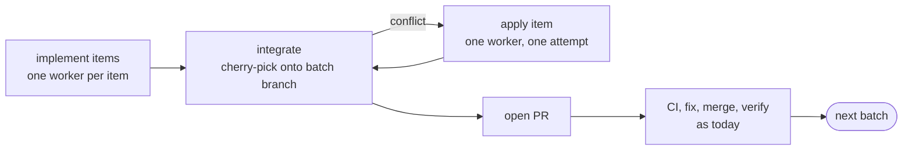

# Notes: deviations from the specification, and choices made

This file records where `backlog-loop` differs from the specification it was
built from, why, and every choice made where the specification was open.

## 1. Verified against the Claude Code docs

Checked against the docs at `code.claude.com/docs` and the installed Claude
Code 2.1.289. Points marked "probed" were also confirmed by running a throwaway
skill with `claude -p`.

| Point | Finding | Consequence |
|---|---|---|
| `hooks` in skill frontmatter | Same format as settings hooks: event, optional `matcher`, list of handlers with `type`, `command`, `timeout`. Registered on invocation, active for the rest of the session. Probed. | Used as documented. |
| Path variables in hook commands | Only `${CLAUDE_PROJECT_DIR}`, `${CLAUDE_PLUGIN_ROOT}` and `${CLAUDE_PLUGIN_DATA}`. `${CLAUDE_SKILL_DIR}` is substituted in the skill body and in `allowed-tools` only; in a hook command it is empty. Probed. | **Deviation.** The hook command looks for the script in `$BACKLOG_LOOP_HOME`, `<project>/.claude/skills/backlog-loop`, then `$HOME/.claude/skills/backlog-loop`, and exits 0 when none has it. |
| Stop hook input | `stop_hook_active`, `last_assistant_message`, `background_tasks`, `session_crons`, plus the common `session_id`, `cwd`, `permission_mode`. Probed. | The gate uses `stop_hook_active`, `background_tasks`, `session_id`, `cwd`, `permission_mode`. |
| Stop hook output | `{"decision": "block", "reason": "..."}` on stdout with exit 0. | Used as documented. |
| Cap on consecutive Stop blocks | 8 in a row, then Claude Code overrides the block and ends the turn. `CLAUDE_CODE_STOP_HOOK_BLOCK_CAP` changes it, `0` disables it. The docs do not say what resets "in a row". | The gate counts its own consecutive blocks: it restarts at 1 when `stop_hook_active` is false. It allows the stop one block before the cap and leaves the run `running`, so `/backlog-loop` resumes. Rule 4 (stall after 2 unchanged checks) needed no change: without progress the gate blocks at most twice. |
| PreToolUse input and deny | Input: `tool_name`, `tool_input.command`. Deny: `hookSpecificOutput.permissionDecision: "deny"` with `permissionDecisionReason`. Top-level `decision` is deprecated for this event. | Used as documented. |
| Permission mode in hook input | `permission_mode` is a common input field. | The gate stores it in `run.permission_mode`. It is informational only. |
| `allowed-tools` | Grants for the invoking turn only; clears at the next user message. Does not restrict other tools. `${CLAUDE_SKILL_DIR}` is substituted in its Bash rules. Probed. | `reference/setup.md` tells the user to add permanent allow rules for unattended runs. |
| `disallowed-tools` | Removes the tools while the skill is active; also clears at the next message. | After a resume in a later turn `AskUserQuestion` is available again. `SKILL.md` forbids asking in any case. |
| Subagents with worktree isolation | The Agent tool takes `isolation: "worktree"`. The worktree branches from the repository default branch, not from the parent's `HEAD`. | The worker prompt checks out `origin/<base-branch>` explicitly, so a non-default base branch works. |
| `Explore` | Built-in, read-only, one-shot. | Used for research. `reference/research.md` names `general-purpose` as the fallback. |
| Background subagents | In interactive sessions subagents always run in the background; the main turn ends while they work, and a notification starts a new turn. | **Addition.** Action `wait_worker`, and the gate allows the stop while `background_tasks` lists running tasks, without counting a stall. |
| Auto mode | The classifier blocks force-push and merging a PR no human approved. Allow rules are evaluated before the classifier. | `reference/setup.md`: add `Bash(gh *)` or use `--no-merge`. |
| Bash tool timeout | 2 minutes by default, 10 at most. | `ci-wait.sh` waits in 100-second slices and is called repeatedly; the deadline is kept in state. |
| `${CLAUDE_SESSION_ID}` | Substituted in the skill body and equal to `session_id` in hook input. Probed. | The lock and the gate compare the two. |

Not verified: a full unattended run in an interactive session. The hooks were
probed with `claude -p` only. The GitHub write paths (PR create, merge, revert,
update-branch, rerun, labels, comments) were exercised against the stub only;
the read paths and the flags were checked against real `gh` 2.102.

Portability: the suite passes on macOS (bash 3.2, jq 1.7.1, shellcheck 0.11)
and in a Debian 12 container (bash 5.2, jq 1.6, git 2.39, shellcheck 0.9).
jq 1.6 shaped two things: no jq reserved word (`label`, `try`, `then`) is used
as a bare key or variable, and every `jq -e` on text that may be empty is
guarded, because jq 1.6 exits 0 there.

## 2. Deviations from the specification

| Spec | What was built | Why |
|---|---|---|
| §2: nine scripts | Two more files in `scripts/`: `lib.sh` (shared helpers) and `backlog.awk` (BACKLOG.md parser). A `.shellcheckrc` in the skill root. | Nine scripts share paths, locking, deadlines and the checks query. The rc file lets shellcheck follow `. lib.sh` and turns off SC2016, which fires on every jq filter. |
| §3: hooks use the skill directory | A lookup loop in the hook command. | See section 1. |
| §3: PreToolUse hook on Bash | Matcher `Bash\|Edit\|Write`. | The state file can also be hand-edited with the file tools. |
| §5: reconcile resets to `todo` or advances to `merged` | In-flight batches keep their phase where GitHub confirms it: an open PR resumes at CI, a merged PR at the base-branch check, a closed PR resets to `todo`, a lost worker returns to `implement`. | Resetting a batch with an open green PR would redo finished work. |
| §5: BACKLOG.md markers | Written once, at the end, by a final "status" pull request. | The guard forbids direct pushes to the base branch, and an uncommitted edit would dirty the main checkout between merges. |
| §6: "Issues: can comment and set labels" | Inferred from write permission and issues being enabled. Labels are created after preflight passes. | A probe comment would spam a real issue, and preflight must change nothing before it passes. |
| §6: "auto-merge enabled if used" | Always passes. | Auto-merge is not used: the loop merges after verifying the checks itself. |
| §6: "Baseline: test, lint and build pass on a clean base branch" | Preflight runs no test suite. The baseline is the CI result of the base branch head, read through `gh`: red fails, still running or no result is a warning. | Changed after the first real trial: running the suite locally before the loop was slow, and CI is the gate the loop trusts everywhere else. |
| §6: "Claude tools" probes per class (git, gh, test, lint, build) | `preflight.sh --probes` prints a `git` and a `gh` command only. | Probing test, lint and build meant running the suite. A missing rule for those shows when the first worker runs them. |
| §4: `test`, `lint`, `build` commands | Not configured and never run. | Decided after the first real trial: nothing is gated locally, the repository's CI is the only test gate. A repository without CI on pull requests fails preflight. |
| §8 step 2: the worker runs test, lint and build before reporting | The worker writes tests but runs nothing; it pushes and CI judges. | Same decision. The cost is that a mistake a local run would have caught now uses one CI round and one attempt. |
| §8 step 7: post-merge check on the base branch | Reads CI for the merge commit on the base branch, with the CI deadline. Red reverts the merge. When the base branch has no CI of its own, or it does not finish in time, the green pull request result stands, because the PR contained the base tip when it merged. | Same decision. |
| §6: "Research: web search and fetch available" | Detected from `deny` and `ask` rules on `WebFetch`/`WebSearch` in settings. | A script cannot call Claude's tools. |
| §8 step 1: rebase on base | A fresh worker branch starts from `origin/<base>`. Before a merge the PR branch is updated with `gh pr update-branch --rebase` (server side). Conflicts are fixed with a merge commit. | A local rebase needs a force-push, which the guard forbids. |
| §8: minimum action set | Added `preflight`, `open_pr`, `wait_ci`, `rerun_ci`, `rebase_batch`, `resolve_conflict`, `wait_worker`, `sync_backlog`. | One action per state keeps each instruction list short and each state testable. |
| §10: CI red "counts as an attempt for the affected items" | Counts for every item in the batch. `state.sh record poison` gives the other items their attempts back once the culprit is named. | The script cannot know which item caused a red PR. |
| §11 rule 4 | Unchanged, plus two extra "allow" cases: background workers in flight, and one block before Claude Code's cap. A run owned by another session is ignored. | See section 1. |
| §11 guard | Also denies: `git push --all`/`--mirror`, `git clean -x`, `gh api .../pulls/N/merge`, every `gh pr merge` under `--no-merge`, and a merge of a batch PR that `verify-batch.sh pre-merge` did not just verify. | Same intent as the four listed rules. |
| §12 limits | Two more: `worker-wait-minutes` 120, `max-batch-items` 15. Lock staleness is 15 minutes (`BACKLOG_LOOP_LOCK_STALE_MINUTES`). | "Every wait has a deadline" needs a worker deadline. |
| §12 max loop iterations | `wait_ci` and `wait_worker` do not count. A resume starts a fresh iteration and wall-clock budget; totals are kept in `run.total_iterations`. | A 45-minute CI wait is 27 polls and would eat the budget. |
| §13 report | Extra lines when they apply: `Merge:` (PRs awaiting the user with `--no-merge`), `Needs:` under a blocked item, re-queues in `Retries:`. | The spec format has no place for them. |
| §14 dry run | The stubs live in `tests/stubs/`. `lib.sh` puts them on `PATH` when `BACKLOG_LOOP_DRY_RUN=1`. The stub `git` also handles `fetch` and `pull`. | Without them the scripts would reach the network. |
| AGENTS.md of this repository: value-gate, behavior-spec, then TDD | Not run. The specification was taken as the approved behaviour. Tests were written with the code, not strictly before it. | The instruction was to build without asking questions; both skills are interactive. |

## 3. Choices where the specification was open

**Configuration**

- The `## Backlog loop` section is read from `CLAUDE.md`, then
  `.claude/CLAUDE.md`, then `AGENTS.md`. Lines are `- key: value`; backticks
  around the value are stripped.
- `source` is detected only when exactly one of the backlog file and labelled
  issues exists. Both or neither fails preflight.
- An unfinished run resumes with the configuration it started with.

**State**

- Batch `status`: `todo`, `in-progress`, `merged`, `blocked`, `pr-ready`
  (green PR awaiting the user), `closed` (emptied, items moved elsewhere).
  A `phase` field holds the step inside `in-progress`.
- Item ids are strings. Items carry `pending` (`block` or `drop`) for a
  transition the scripts decided and the agent still has to carry out.
- The state hash covers items, batches and run status. Iteration count, gate
  counters and the lock are excluded, so only real progress changes it.
- The lock holds the session id. Its mtime is the heartbeat, refreshed by
  `next.sh`, `ci-wait.sh`, `state.sh record` and the guard hook. Another
  session may take it over after 15 minutes without a heartbeat.
- When a run is done its branches, worktrees, `run.log` and working files are
  removed; state, plan, report and decision records stay. A halted or stalled
  run keeps everything.
- A finished run is moved to `archive/<run id>/` when the next run starts.
- Branch names: `backlog-loop/<run id>/b<batch>-t<tries>`. A re-queued or
  reset batch gets a new branch.

**Loop**

- `next.sh` picks by fixed priority: block, revert, verify, merge, rebase,
  conflict, drop, fix, rerun, open PR, research, implement, wait for CI, wait
  for workers. Finishing work comes before starting work; at most one batch is
  in merge or verification at a time.
- A worker's result is read from the branch: one commit per item with the
  trailer `Backlog-Item: <id>`. Items without one count as a failed attempt.
- A dropped item is retried alone in a new batch. Batches that depended on its
  old batch also wait for the retry, but are not blocked if the retry fails.
- A batch whose items are all blocked is `blocked`, and the items of batches
  that depend on it are blocked with that reason.
- With `--no-merge`, batches that depend on an unmerged PR are not stacked. The
  run halts and `--resume` continues after the user merged.
- Merge conflict: one worker attempt, then the batch is re-queued last. A
  second re-queue blocks its items.
- A merge the scripts cannot confirm three times blocks the batch's items.
- If the revert of a red base branch fails, the run halts with an urgent
  reason. It does not try to fix forward.

**Mirroring (GitHub)**

- Labels `blocked` and `needs-review` only. No in-progress label.
- Comments: the blocker text, and the decision record.
- Merged items are closed by `Closes #<id>`; if the base branch is not the
  default branch the script closes them with a comment.
- Mirroring is best effort. A failed comment is logged, never fatal.

**Tests**

- Plain bash, because this repository has no test framework.
- Besides the four required unit suites there is `test-scenarios.sh`, which
  runs the failure paths on the fixture repository.

## 4. Known limits

- The guard parses shell text with patterns, not a shell parser. It errs
  towards denying; a command hidden behind `eval` or a script file is not seen.
- A background worker that hangs is noticed only when `next.sh` next runs
  (after `worker-wait-minutes`); nothing wakes an idle session. The run stays
  resumable.
- Classic branch protection is readable only with admin rights. Without them
  the "Branch rules" check sees rulesets only.
- Fine-grained tokens report no scopes; the scope check is skipped for them.
- Git submodules and Windows are not supported.
- Whether auto mode keeps the wildcard allow rule for the skill's scripts is
  not documented. If it drops it, script calls go to the classifier.

## 5. Kept compatible with later work (spec §15)

- **Detached driver:** every script takes its input from state and arguments,
  and `next.sh` returns one self-contained action. A driver can run one
  `claude -p "/backlog-loop --resume"` per batch against the same state
  directory; the lock keeps two from overlapping.
- **Plugin packaging:** the hook lookup already starts with
  `$BACKLOG_LOOP_HOME`; in a plugin the hook command can use
  `${CLAUDE_PLUGIN_ROOT}` directly. The worker prompt in
  `reference/implementer.md` can become a bundled subagent definition without
  touching the scripts.
- `state.json` carries `version: 1`.

## 6. Parallel items per batch

**Status:** accepted and built, 2026-10-04. Where sections 3 and 5 describe
batch workers, `depends_on`, `parallel-batches` or `version: 1`, this section
replaces them.

### Context

A batch has one worker that implements its items one after another. Several
batches run at once, but a plan with one large batch, or a chain of dependent
batches, runs a single worker. A trial run showed exactly that bottleneck.
Subagents cannot start subagents, so a worker cannot split its batch.

What must hold:

- One CI run per batch, not per item.
- One commit per item inside the PR, so a single item can still be dropped.
- Scripts decide and verify; the agent only executes (section 3, Loop).

### Decision

Batches run one at a time, in plan order. The items of a batch run in
parallel, one worker each.

1. **Implement items.** One worker per item, at most `parallel-items` at once
   (replaces `parallel-batches`; default 5). Each worker branches from
   `origin/<base>` as `backlog-loop/<run>/b<batch>/i<item>-t<try>`, makes one
   commit with the `Backlog-Item` trailer, and does not push. Worktrees share
   the repository's refs, so the commit is visible from the main checkout.
   `state.sh record item-done <item>` checks that local branch: exactly one
   commit ahead of `origin/<base>`, with the right trailer.
2. **Integrate.** When every item of the batch has finished or failed,
   `state.sh integrate <batch>` builds the batch branch from `origin/<base>`
   in a scratch worktree and cherry-picks the finished items in plan order.
   The branch stays local. A cherry-pick that conflicts is aborted and the
   item is marked for the next step; the others continue.
3. **Apply a conflicting item.** One worker per conflicting item, one at a
   time, on the local batch branch: it applies the item's change by hand and
   commits with the trailer. If it fails, the item is deferred.
4. **Open the PR** once no item is waiting: `state.sh open-pr` pushes the
   batch branch, the only push of the batch, and creates the PR. From here the
   batch follows the existing path: CI wait, rerun, fix, drop, update from
   base, merge, verify.
5. **Next batch** starts after the merge is verified. Research for the next
   batch's unclear items may run while the current batch waits for CI.

**Deferral.** A deferred item moves to the next batch, or to a new last batch.
A failed worker (no commit, crash, past `worker-wait-minutes`) and a failed
apply each count one attempt; three attempts block the item, as today. A
batch whose items were all deferred or blocked closes without a PR.

**Dependencies are per item.** Plan items are an id or
`{"id": "15", "tier": "light", "needs": ["12"]}`. An item starts only when
every item in `needs` is merged; otherwise it is deferred without counting an
attempt. If a needed item is blocked, the item is blocked with that reason.
Batch `depends_on` is removed: batches are sequential, so each one builds on
everything merged before it.

**Model per item.** `tier` on the batch is the default and an item may
override it. Fix and drop workers act on the whole batch and use the highest
tier among its items.

**Project agents.** Optional keys `agent-light`, `agent-standard` and
`agent-complex` name a subagent type (for example a project's
`.claude/agents/backlog-worker.md`). When set, the worker is spawned with that
`subagent_type` and no `model`, so the agent file decides model, effort and
tools. Without them the worker is `general-purpose` with the tier's model.
Preflight warns when a named agent file is not found in the project or user
agent directory. The skill ships no agent files.

**Commit shape.** `batch-commits: per-item` (default) or `squashed`. With
`squashed`, `integrate` (and `open-pr`, after apply workers) folds the applied
items into one commit carrying every
`Backlog-Item` trailer. Dropping a single item is then impossible: a red CI is
fixed by a worker or, after the attempts run out, blocks the batch's items.
With the default squash merge both shapes land on the base branch as one
commit; the option only changes the PR history.

**Unchanged:** the guard, the Stop gate, CI as the only test gate, the merge
and revert path, `--no-merge`, reporting. Under `--no-merge` every batch
builds on the previous one, so the run halts after each green PR until the
user merges.

### Alternatives considered

| Option | Why not |
|---|---|
| Keep one worker per batch, plan smaller batches | Parallel only across batches; each batch costs a CI run, and dependent items still serialise. |
| A prompt-driven `/loop` with more context | Attempt counting, the READY check before merge, revert on a red base and resume after compaction would move from scripts into the prompt. |
| One PR per item | One CI run per item, which is what batching avoids. |
| Workers commit to one shared batch branch | Concurrent pushes to one branch race; each would need a rebase, which the guard forbids without force-push. |
| Parallel items as an option next to the current model | Two state machines, every transition and test twice. |
| Pipeline: start the next batch while the current one is in CI | Its items would build on unmerged code. Rejected for now; batches merge in order. |

### Consequences

- A batch of ten independent items takes about as long as its slowest item,
  then one CI run.
- Batches no longer overlap, so CI waits add up: fewer, larger batches pay
  off. `batching.md` changes from "cluster by theme" to "group independent
  items; put an item after the items it needs".
- More agent sessions: each worker reads the code it touches on its own.
- Items in one batch that edit the same lines now conflict at integration.
  The planner should keep them apart; the apply step and deferral catch the
  rest.
- `state.json` moves to `version: 2`. A run started with version 1 cannot be
  resumed by the new scripts; preflight says so and asks to finish it with
  the previous version or start a new run.
- To verify when building: a branch committed inside an Agent worktree stays
  visible from the main checkout after the worktree is cleaned up.
