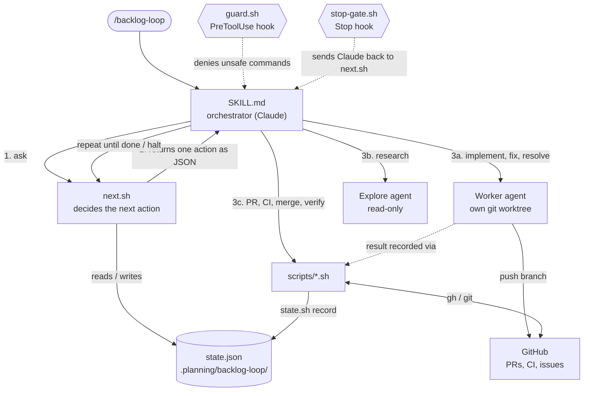
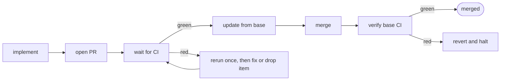

# backlog-loop

A Claude Code skill that works through a project backlog on its own. It groups
related items, implements each group as one pull request, waits for CI, merges,
and moves on. Items it cannot finish are marked blocked with a reason. You come
back to merged work and a short report.

- **Few, themed PRs.** Around ten pull requests for a hundred items, each
  reviewable on its own.
- **CI is the only judge.** The loop runs no tests locally. A PR merges only
  when every check is green, and the base branch is checked again afterwards.
- **No questions.** An unclear item is researched and decided, and the decision
  is written down for you to review later.
- **Safe to interrupt.** The run lives on disk. After a crash, a usage limit or
  a closed terminal, run the command again and it continues.

## Quick start

1. [Install the skill](../../README.md#installation) and give your backlog a
   home: GitHub issues with a `backlog` label, or a `BACKLOG.md` file.
2. Make sure the repository has CI on pull requests and a green base branch.
3. Start it from the main checkout:

```text
/backlog-loop
```

It checks your setup first and lists anything to fix before it changes
anything.

## Examples

Start a run, or pick up an unfinished one:

```text
/backlog-loop
```

Look at the plan before anything is built:

```text
/backlog-loop --plan-only
/backlog-loop --resume          # happy with it? run it
```

Keep the merge button for yourself. Each batch stops at a green PR:

```text
/backlog-loop --no-merge
```

What you get at the end:

```text
Backlog loop finished: done
Items:   14 merged, 1 blocked, 0 remaining
PRs:     #201 #202 #203 #204 (4 PRs for 14 items)
Blocked: #37 "Redesign address form"
         Reason: needs production API credentials
Review:  #29 decided with low confidence, see decisions/29.md
Report:  .planning/backlog-loop/report.md
```

## Configuration

Optional. Add a section to the project's `CLAUDE.md`:

```markdown
## Backlog loop

- source: github
- label: backlog
- merge-method: squash
```

Everything that can be detected is detected. Limits, backlog formats,
permissions for unattended runs, troubleshooting and the files a run leaves
behind are in [`reference/setup.md`](reference/setup.md).

## What it will not do

Force-push, push to the base branch, merge a PR that has not been verified
green, or edit its own state file. A guard hook enforces this while a run is
active.

---

## Technical spec

### Relation chain



Scripts decide, Claude executes. Claude never counts attempts, applies limits
or edits state; it runs the commands an action names, and the scripts verify
the outcome against git and GitHub rather than trusting the agent's report.

### One batch, start to finish



Items that fail three attempts, or hit a hard blocker (missing credentials,
destructive change), are marked blocked and leave the batch. Unclear items get
one research pass and a decision record before their batch starts.

### Components

| Part | Role |
|---|---|
| `SKILL.md` | Instructions for the orchestrating agent: run `next.sh`, do what it says, repeat. |
| `scripts/next.sh` | Picks the next action from state by fixed priority. |
| `scripts/state.sh` | The only writer of `state.json`; records results after checking git and GitHub. |
| `scripts/preflight.sh` | Verifies tools, access, CI and a clean tree before a run starts. |
| `scripts/ci-wait.sh`, `verify-batch.sh` | Wait for CI and confirm merge readiness and the post-merge result. |
| `scripts/guard.sh`, `stop-gate.sh` | Hooks: block unsafe commands; keep the run going until it is done, halted or stalled. |
| `reference/` | Playbooks the agent reads on demand: batching, research, failures, worker prompt, setup. |
| `tests/` | Plain-bash unit, scenario and dry-run suites; run in CI. |

`NOTES.md` records where the implementation deviates from its original
specification and why.
