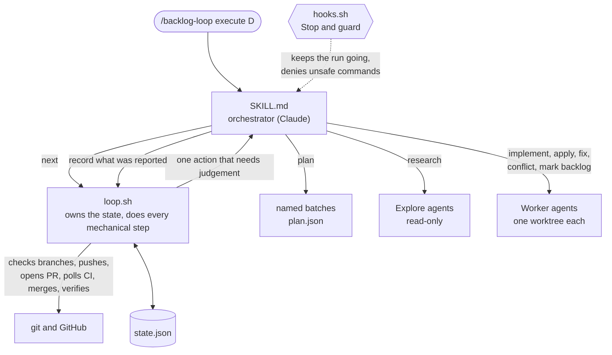
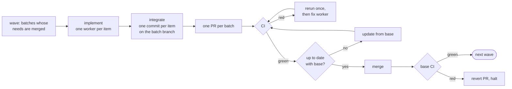

# backlog-loop

A Claude Code skill that works through a project backlog on its own. One
command replaces a prompt like this:

> Pick up batch D and start working on that in parallel with subagents. If
> errors occur, reason with them to resolve conflicts. Create 1 PR per batch.
> If something needs input from user, research the topic to find the best
> answers and use that as the input. If something is still not clear, put the
> item to the side. When everything is merged, report back with what was
> implemented and then list the remaining items/batches.

```text
/backlog-loop plan
/backlog-loop execute D
```

- **Two commands.** `plan` groups the backlog into batches and builds
  nothing. `execute` builds batches and never plans.
- **The whole backlog is read.** `plan` reads every open item and decides
  for each whether it can be built here. What it leaves out (already done,
  blocked outside the repository, not a work item) is listed with the reason.
- **Named batches.** `plan` groups the open items by theme and by what
  depends on what, into batches A, B, C… The names stay valid between
  sessions.
- **Waves.** Batches that do not depend on each other start together. Each
  batch gets one worker per item and lands as one pull request.
- **CI is the only judge.** Nothing is tested locally. A pull request merges
  only when its checks are green on top of the current base branch.
- **No questions.** An unclear item is researched and decided, with a
  decision record. If research does not settle it, the item is set aside and
  the run goes on.
- **Safe to interrupt.** The run lives on disk. Run `/backlog-loop execute`
  again after a crash, a usage limit or a closed terminal and it continues.

## Quick start

1. [Install the skill](../../README.md#installation). The backlog can be
   GitHub issues or a backlog file such as `BACKLOG.md`.
2. Make sure the repository has CI on pull requests and a green base branch.
3. Run it:

```text
/backlog-loop plan           # group the backlog into batches and look at them
/backlog-loop execute D      # run one batch
/backlog-loop execute        # or run everything that remains, wave by wave
```

## Examples

Run two batches. They share a wave unless one needs the other:

```text
/backlog-loop execute B D
```

Keep the merge button for yourself. Each batch stops at a green pull request:

```text
/backlog-loop execute --no-merge
```

See where things stand without changing anything:

```text
/backlog-loop status
```

What you get at the end:

```text
Backlog loop: done

Implemented in this run
  Batch D "Address form (1/2): validation": PR #214, merged
    012: Validate the postal code
    015: Fix the street label typo
    021: Validate the country  [decided by research, medium confidence: decisions/021.md]

Set aside
  037: Redesign the address form
    Why: research did not settle it: which of the two mockups is current?
    Needs: the owner's choice between the two mockups

Remaining
  Batch E "Address form (2/2): checkout summary"
    029: Show the validated address in the summary
  Batch F "Receipts" (needs E, which is todo)
    031: Email a receipt

Left out of the plan (read 9 open items from BACKLOG.md)
  Already done
    008: Send the receipt email
      Why: Shipped in #41; only the provider's domain check is left.
  Not a work item
    030: Checkout epic
      Why: Tracks 012, 015, 021 and 029.
```

## What it will not do

Merge a pull request that is not green and up to date, force-push, push to
the base branch, or build an item on a guess. If the base branch goes red
after a merge, the loop opens the revert pull request, halts, and leaves the
revert to you.

Configuration, permissions for unattended runs, the run's files and
troubleshooting are in [`reference/setup.md`](reference/setup.md).

---

## How it works



The script decides, the agent executes. `loop.sh next` first advances every
batch as far as it can without help, then returns the one thing that needs an
agent. The agent never counts attempts, picks the next step or merges. A
worker's report is a claim: the script reads the branch.

### One wave



Batches of a wave merge one at a time. After the first merge the others are
behind the base branch: each is updated and tested again before it merges.

### What ends where

| Situation | Outcome |
|---|---|
| A worker reports done without its commit | One retry, then the item is set aside. |
| An item is unclear | One research pass. High or medium confidence: built, with a decision record. Low: set aside. |
| An item needs credentials or a destructive operation | Set aside with what it needs. |
| Two items of a batch conflict | A worker applies the second by hand; if that fails the item waits for a later batch. |
| CI is red | Failed jobs are rerun once, then a worker fixes it. It may drop one item with a revert. After two failed fixes the batch is set aside with its pull request open. |
| A batch conflicts with the base branch | One worker merges the base branch in; if that fails the batch is set aside. |
| The needed batch was set aside | The batch does not run and is reported as remaining. |
| The base branch is red after a merge | A revert pull request is opened and the run halts. |

### Files

| Part | Role |
|---|---|
| `SKILL.md` | Instructions for the orchestrator: start, run `next`, do what it says, repeat. |
| `scripts/loop.sh` | The harness: state, waves, integration, pull requests, CI, merge, verification, report. |
| `scripts/hooks.sh` | Stop hook (keep going while work remains) and guard hook (deny unsafe commands). |
| `reference/planning.md` | How to split a backlog into batches and waves; the plan format. |
| `reference/workers.md` | Worker and research prompts, decision rules and the decision record. |
| `reference/setup.md` | Configuration, permissions, files, troubleshooting. |
| `tests/` | Plain-bash scenario and hook suites with a stub `gh`; run in CI. |
| `NOTES.md` | Design decisions, verified Claude Code behaviour, known limits. |
